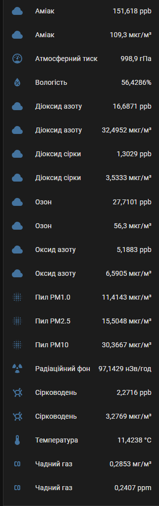

#### Ukraine is still suffering from Russian aggression, [please consider supporting Red Cross Ukraine with a donation](https://redcross.org.ua/en/).

---

# SaveEcoBot Integration for Home Assistant

[Українською нижче ⬇️]

## English

Custom integration for monitoring SaveEcoBot air quality stations in Home Assistant. Supports multi-language interface (English, Ukrainian), dynamic sensor creation for all available phenomena, and automatic updates.

### Features
- **Multi-language support**: English, Ukrainian
- **Dynamic sensors**: All available air quality parameters (AQI, NH3, PM2.5, etc.)
- **Automatic update**: Update interval configurable (1-60 minutes)
- **Unique entity IDs**: e.g., `sensor.saveecobot_14634_aqi`
- **UI configuration**: Configure via Home Assistant UI
- **Automatic device and sensor naming**: Based on station address

### Installation
1. Copy the `custom_components/ha_saveecobot` folder to your Home Assistant `custom_components` directory
2. Restart Home Assistant
3. Go to **Settings → Devices & Services → Add Integration**
4. Search for "SaveEcoBot"
5. Enter your station marker ID and select update interval/language

### Configuration
- **Marker ID**: Your SaveEcoBot station marker (see https://www.saveecobot.com/)
- **Update Interval**: How often to fetch data (1-60 minutes)
- **Language**: Interface language (auto-detected from Home Assistant profile)

### Sensors
- All available air quality parameters from your station will be created as sensors
- Example: `sensor.saveecobot_14634_aqi`, `sensor.saveecobot_14634_nh3_ppb`, etc.
- Each sensor has unique_id and friendly name

#### Example UI

Below is an example of how SaveEcoBot sensors appear in the Home Assistant UI:

- Each sensor displays its friendly name, value, and unit (localized)
- Sensors are grouped by device (station)
- All available air quality parameters are shown

_See [translations/uk.json](./ha_saveecobot/translations/uk.json) and [translations/en.json](./ha_saveecobot/translations/en.json) for localization details._

### Troubleshooting
- Check **Settings → System → Logs** for `ha_saveecobot` entries
- Ensure your marker ID is correct and the station is online
- If sensors do not update, check your network and Home Assistant logs

---

# Інтеграція SaveEcoBot для Home Assistant

[English above ⬆️]

Кастомна інтеграція для моніторингу станцій SaveEcoBot у Home Assistant. Підтримує багатомовний інтерфейс (українська, англійська), динамічне створення сенсорів для всіх доступних параметрів якості повітря та автоматичне оновлення.

### Можливості
- **Багатомовна підтримка**: українська, англійська
- **Динамічні сенсори**: всі доступні параметри якості повітря (AQI, NH3, PM2.5 тощо)
- **Автоматичне оновлення**: інтервал оновлення налаштовується (1-60 хвилин)
- **Унікальні entity_id**: наприклад, `sensor.saveecobot_14634_aqi`
- **Налаштування через UI**: інтеграція налаштовується через інтерфейс Home Assistant
- **Автоматичне іменування пристрою та сенсорів**: за адресою станції

### Встановлення
1. Скопіюйте папку `custom_components/ha_saveecobot` у директорію `custom_components` вашого Home Assistant
2. Перезапустіть Home Assistant
3. Перейдіть у **Налаштування → Пристрої та служби → Додати інтеграцію**
4. Знайдіть "SaveEcoBot"
5. Введіть marker ID станції, оберіть інтервал оновлення та мову

### Налаштування
- **Marker ID**: marker вашої станції SaveEcoBot (див. https://www.saveecobot.com/)
- **Інтервал оновлення**: як часто оновлювати дані (1-60 хвилин)
- **Мова**: мова інтерфейсу (автоматично визначається з профілю Home Assistant)

### Сенсори
Для всіх доступних параметрів якості повітря будуть створені сенсори
Приклад: `sensor.saveecobot_14634_aqi`, `sensor.saveecobot_14634_nh3_ppb` тощо
Кожен сенсор має унікальний ID та дружню назву

#### Приклад інтерфейсу

Нижче наведено приклад того, як виглядають сенсори SaveEcoBot в інтерфейсі Home Assistant:

- Кожен сенсор відображає дружню назву, значення та одиницю вимірювання (локалізовано)
- Сенсори згруповані за пристроєм (станцією)
- Відображаються всі доступні параметри якості повітря

_Деталі локалізації дивіться у [translations/uk.json](./ha_saveecobot/translations/uk.json) та [translations/en.json](./ha_saveecobot/translations/en.json)._ 

### Усунення несправностей
- Перевірте **Налаштування → Система → Логи** на наявність записів `ha_saveecobot`
- Переконайтеся, що marker ID вірний, а станція онлайн
- Якщо сенсори не оновлюються, перевірте мережу та логи Home Assistant

---

