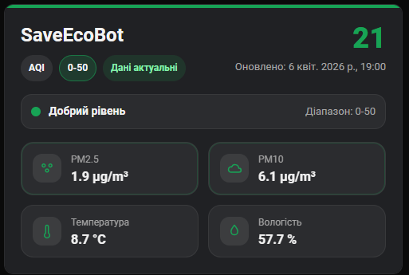

[](https://stand-with-ukraine.pp.ua)

#### Ukraine is still suffering from Russian aggression, [please consider supporting Red Cross Ukraine with a donation](https://redcross.org.ua/en/).

[](https://stand-with-ukraine.pp.ua)

---

# SaveEcoBot Integration for Home Assistant

[Українською нижче ⬇️]

[](https://my.home-assistant.io/redirect/hacs_repository/?owner=uhodav&repository=ha-saveecobot&category=integration)

## English

Custom integration for monitoring SaveEcoBot air quality stations in Home Assistant. It supports English and Ukrainian, creates sensors dynamically based on the selected station, and keeps values up to date automatically.

### Features
- **Config flow setup**: add the integration directly from the Home Assistant UI
- **Dictionary-based setup wizard**: select `region → city → district (if available) → monitoring station`
- **Localized UI**: English and Ukrainian translations for setup and entities
- **Dynamic air-quality sensors**: AQI, PM, gases, temperature, humidity, pressure, and other available station data
- **Stable entity IDs**: for example, `sensor.saveecobot_14634_aqi`
- **Device grouping**: all entities for the selected station are grouped under one device
- **Custom Lovelace card**: bundled station overview card with AQI, PM2.5, PM10, temperature, humidity, `updated_at`, and stale-data status
- **Device settings**:
	- `update_interval` is available as an editable slider in **Settings**
- **Diagnostics**:
	- `marker_id` is shown as a read-only sensor
	- timer/debug sensors: `configured_interval_min`, `current_interval_min`, `next_update_in`
- **Automatic polling**: update interval from 1 to 60 minutes

### Installation
#### Option 1: HACS
1. Open HACS
2. Add this repository as a custom integration if needed
3. Install **SaveEcoBot**
4. Restart Home Assistant

#### Option 2: Manual installation
1. Copy the `ha_saveecobot` folder into your Home Assistant configuration directory under:
	 - `custom_components/ha_saveecobot`
2. Restart Home Assistant

#### Add the integration
1. Go to **Settings → Devices & Services**
2. Click **Add Integration**
3. Search for **SaveEcoBot**
4. Select a **region**
5. Select a **city**
6. Select a **district** (if available for the chosen city)
7. Select a **monitoring station**
8. Select the update interval

### Configuration
- **Region / City / District / Station**: selected in the setup wizard when creating the integration
- **Update Interval**: selected during setup and later editable from the device Settings block
- **Language**: taken from the Home Assistant user interface language

### Reference dictionaries (regions/cities/districts/stations)

The setup wizard uses prebuilt dictionaries stored in:

- `ha_saveecobot/translations/en/*.json`
- `ha_saveecobot/translations/uk/*.json`

To refresh dictionaries from SaveEcoBot APIs, run:

- English dictionaries: set `HA_UI_LANGUAGE=en` and run `scripts/generate_reference_dictionaries.ps1`
- Ukrainian dictionaries: set `HA_UI_LANGUAGE=uk` and run `scripts/generate_reference_dictionaries.ps1`

The script updates only new marker IDs and keeps existing data, so routine refreshes are incremental.

After setup:
- `update_interval` remains available as an editable slider in the device **Settings** block
- `marker_id` is available as a read-only diagnostic sensor
- timer/debug values are available as separate diagnostic sensors (`configured_interval_min`, `current_interval_min`, `next_update_in`)
- there is no separate options dialog for routine changes

### Sensors
- All supported station phenomena are created automatically from SaveEcoBot data
- Example entities:
	- `sensor.saveecobot_14634_aqi`
	- `sensor.saveecobot_14634_pm25`
	- `sensor.saveecobot_14634_temperature`
- Station metadata such as latitude, longitude, type, and similar values are shown as diagnostic entities
- `AQI` is exposed as a numeric sensor

#### Example UI

Below is an example of how SaveEcoBot sensors appear in the Home Assistant UI:


- Friendly names and units are localized
- Entities are grouped under a single SaveEcoBot station device
- Settings and diagnostic values are separated from the main measurement sensors

_See [translations/uk.json](./ha_saveecobot/translations/uk.json) and [translations/en.json](./ha_saveecobot/translations/en.json) for localization details._

### Custom Lovelace card

The integration includes a bundled Lovelace card that highlights the most important air-quality data with color-coded AQI levels.



#### What it shows
- AQI
- PM2.5 / PM10
- temperature / humidity
- `updated_at`
- `is_old` status
- color accent based on pollution level

#### Add the resource
After the integration is loaded, add this Lovelace resource:

- URL: `/ha_saveecobot/saveecobot-card.js`
- Resource type: `JavaScript module`

#### Card example

```yaml
type: custom:saveecobot-card
marker_id: 14634
title: SaveEcoBot
```

#### Optional entity overrides

If needed, you can override auto-detected entities explicitly:

```yaml
type: custom:saveecobot-card
aqi_entity: sensor.saveecobot_14634_aqi
pm25_entity: sensor.saveecobot_14634_pm25
pm10_entity: sensor.saveecobot_14634_pm10
temperature_entity: sensor.saveecobot_14634_temperature
humidity_entity: sensor.saveecobot_14634_humidity
title: Kyiv station
```

### Troubleshooting
- Check **Settings → System → Logs** for `ha_saveecobot` entries
- If you don't see stations during setup, refresh reference dictionaries and retry
- If the integration does not load, verify Internet access from Home Assistant
- If data does not refresh, check the configured `update_interval` and Home Assistant logs
- If entity names or IDs look stale after an upgrade, reload the integration or restart Home Assistant

---

# Інтеграція SaveEcoBot для Home Assistant

[English above ⬆️]

Кастомна інтеграція для моніторингу станцій SaveEcoBot у Home Assistant. Підтримує українську та англійську мови, динамічно створює сенсори для вибраної станції та автоматично оновлює дані.

### Можливості
- **Налаштування через config flow**: додавання інтеграції напряму з інтерфейсу Home Assistant
- **Майстер налаштування на основі довідників**: вибір `область → місто → район (за наявності) → станція`
- **Локалізований інтерфейс**: українська та англійська для налаштування й назв сутностей
- **Динамічні сенсори якості повітря**: AQI, пил, гази, температура, вологість, тиск та інші доступні показники
- **Стабільні entity_id**: наприклад, `sensor.saveecobot_14634_aqi`
- **Групування за пристроєм**: усі сутності станції зібрані під одним пристроєм
- **Кастомна Lovelace-картка**: оглядова картка станції з AQI, PM2.5, PM10, температурою, вологістю, `updated_at` та статусом застарілих даних
- **Налаштування пристрою**:
	- `update_interval` доступний для зміни через повзунок у блоці `Налаштування`
- **Діагностика**:
	- `marker_id` відображається як сенсор лише для читання
	- таймери/відладка: `configured_interval_min`, `current_interval_min`, `next_update_in`
- **Автоматичне опитування**: інтервал від 1 до 60 хвилин

### Встановлення
#### Варіант 1: через HACS
1. Відкрийте HACS
2. Додайте цей репозиторій як кастомну інтеграцію, якщо потрібно
3. Встановіть **SaveEcoBot**
4. Перезапустіть Home Assistant

#### Варіант 2: вручну
1. Скопіюйте папку `ha_saveecobot` у директорію конфігурації Home Assistant за шляхом:
	 - `custom_components/ha_saveecobot`
2. Перезапустіть Home Assistant

#### Додавання інтеграції
1. Перейдіть у **Налаштування → Пристрої та служби**
2. Натисніть **Додати інтеграцію**
3. Знайдіть **SaveEcoBot**
4. Оберіть **область**
5. Оберіть **місто**
6. Оберіть **район** (якщо доступний для вибраного міста)
7. Оберіть **станцію моніторингу**
8. Оберіть інтервал оновлення

### Налаштування
- **Область / Місто / Район / Станція**: задаються в майстрі під час створення інтеграції
- **Інтервал оновлення**: задається під час створення та потім може змінюватися у блоці налаштувань пристрою
- **Мова**: береться з мови інтерфейсу Home Assistant

### Довідники (області/міста/райони/станції)

Майстер налаштування використовує попередньо згенеровані довідники у:

- `ha_saveecobot/translations/en/*.json`
- `ha_saveecobot/translations/uk/*.json`

Щоб оновити довідники з API SaveEcoBot, запустіть:

- Англійські довідники: встановіть `HA_UI_LANGUAGE=en` і запустіть `scripts/generate_reference_dictionaries.ps1`
- Українські довідники: встановіть `HA_UI_LANGUAGE=uk` і запустіть `scripts/generate_reference_dictionaries.ps1`

Скрипт оновлює лише нові marker ID і зберігає вже відомі дані, тому регулярні оновлення інкрементальні.

Після створення інтеграції:
- `update_interval` залишається доступним для редагування повзунком у блоці **Налаштування**
- `marker_id` доступний як діагностичний сенсор лише для перегляду
- таймерні/відладочні значення доступні окремими діагностичними сенсорами (`configured_interval_min`, `current_interval_min`, `next_update_in`)
- окреме вікно опцій для щоденних змін не використовується

### Сенсори
- Для всіх підтримуваних параметрів станції сенсори створюються автоматично
- Приклади сутностей:
	- `sensor.saveecobot_14634_aqi`
	- `sensor.saveecobot_14634_pm25`
	- `sensor.saveecobot_14634_temperature`
- Метадані станції, як-от широта, довгота, тип та подібні значення, відображаються як діагностичні сутності
- `AQI` експортується як числовий сенсор

#### Приклад інтерфейсу

Нижче наведено приклад того, як виглядають сенсори SaveEcoBot в інтерфейсі Home Assistant:


- Назви та одиниці вимірювання локалізовані
- Усі сутності станції згруповані під одним пристроєм SaveEcoBot
- Основні вимірювання відокремлені від діагностичних і конфігураційних значень

_Деталі локалізації дивіться у [translations/uk.json](./ha_saveecobot/translations/uk.json) та [translations/en.json](./ha_saveecobot/translations/en.json)._ 

### Кастомна Lovelace-картка

Інтеграція містить вбудовану Lovelace-картку, яка показує головні показники якості повітря з кольоровою індикацією рівня забруднення.


#### Що відображається
- AQI
- PM2.5 / PM10
- температура / вологість
- `updated_at`
- статус `is_old`
- кольоровий акцент залежно від рівня забруднення

#### Додавання ресурсу
Після завантаження інтеграції додайте ресурс Lovelace:

- URL: `/ha_saveecobot/saveecobot-card.js`
- Тип ресурсу: `JavaScript module`

#### Приклад картки

```yaml
type: custom:saveecobot-card
marker_id: 14634
title: SaveEcoBot
```

#### Необов'язкові явні сутності

За потреби можна явно вказати сутності замість автопошуку:

```yaml
type: custom:saveecobot-card
aqi_entity: sensor.saveecobot_14634_aqi
pm25_entity: sensor.saveecobot_14634_pm25
pm10_entity: sensor.saveecobot_14634_pm10
temperature_entity: sensor.saveecobot_14634_temperature
humidity_entity: sensor.saveecobot_14634_humidity
title: Київська станція
```

### Усунення несправностей
- Перевірте **Налаштування → Система → Логи** на наявність записів `ha_saveecobot`
- Якщо під час налаштування не видно станцій, оновіть довідники й повторіть спробу
- Якщо інтеграція не завантажується, перевірте доступ Home Assistant до Інтернету
- Якщо дані не оновлюються, перевірте налаштований `update_interval` і логи Home Assistant
- Якщо після оновлення назви або ключі сутностей виглядають застарілими, перезавантажте інтеграцію або Home Assistant

---

[](https://stand-with-ukraine.pp.ua)
